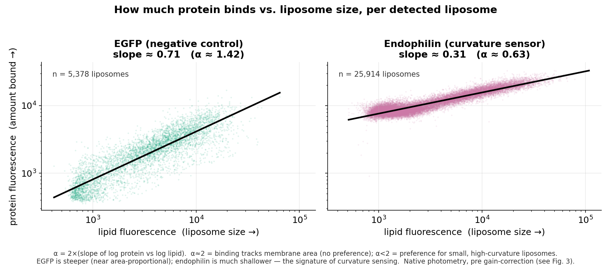
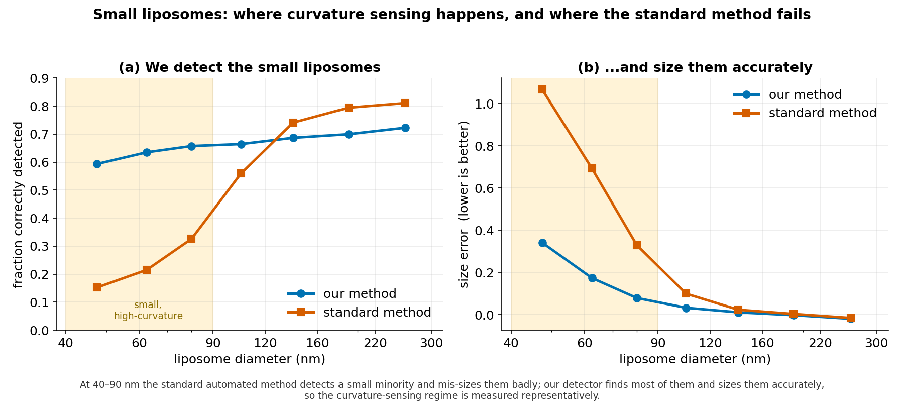
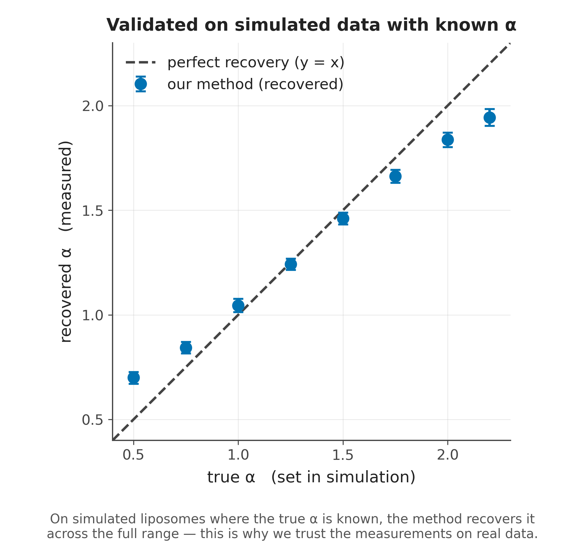
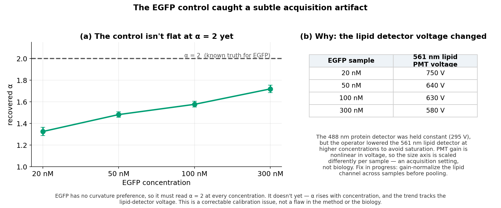

# Progress update — curvature-sensing measurement on real liposome data

**Date:** 2026-06-12 · **Branch:** `stage2-models`

## Summary

I have a working per-liposome curvature-sensing measurement running on the real
EGFP and endophilin samples, built on a forward simulator calibrated to our own
microscope. Results below are stated in terms of $\alpha$, the slope of
$\log(\text{protein})$ vs $\log(\text{lipid})$ across detected liposomes:
$\alpha = 2$ is area-proportional binding (no curvature preference), $\alpha < 2$
indicates a curvature sensor. EGFP is the $\alpha = 2$ negative control. (Plotted
slopes are $\alpha/2$, since lipid signal scales with area.)

## What I built

The new pieces since the last U-Net work are: (i) a forward model of our confocal
calibrated jointly across samples to our acquisition data, (ii) a current
detector trained on its synthetic output, and (iii) the measurement pipeline that
turns detections into per-liposome size and protein loading and fits $\alpha$.
Calibrating the simulator to our own scope is what makes the sizing and intensity
readouts trustworthy on faint, small liposomes; that trust is then checked
against known-answer synthetic data (Fig. 4).

### Forward model

Each liposome is rendered as a point source, convolved with the measured PSF to
give per-pixel signal $S$, then passed through the standard EMCCD/PMT detector
chain:

$$
\begin{aligned}
\lambda &= S + D + C && \text{(expected electrons: signal, dark, clock-induced)} \\
N &\sim \mathrm{Poisson}(\lambda) && \text{(shot noise)} \\
\mathrm{Var}[I] &\approx F^2 g^2\,(S + D + C) + \sigma_\text{read}^2,\quad F \approx \sqrt{2} && \text{(stochastic gain, excess-noise factor }F) \\
I_e &= g\,N + b + \mathcal{N}(0,\,\sigma_\text{read}^2) && \text{(bias + read noise)} \\
I_\text{ADU} &= \mathrm{clip}\!\left(\mathrm{round}(I_e / k),\; 0,\; 2^{12}-1\right) && \text{(digitize, 12-bit)}
\end{aligned}
$$

Gain $g$, excess-noise factor $F$, and background are fit in calibration; bias
$b$, read noise $\sigma_\text{read}$, and frame-averaging are pinned from dark
frames. Note $F \approx \sqrt{2}$ is the high-gain approximation and deviates at
low gain — directly relevant to Fig. 3, where the lipid detector was run at
different voltages (hence different gain regimes) per sample.

## Results

### The measurement works (Fig. 1)

EGFP gives a near-area-proportional relationship (slope $\approx 0.71$,
$\alpha \approx 1.4$); endophilin, the positive control, is markedly shallower
(slope $\approx 0.31$, $\alpha \approx 0.6$), well below the area-proportional
value. The gap between the two slopes is the curvature-sensing signal, read
directly from the per-liposome data. (Raw slopes, before the gain correction of
Fig. 3.)

### Detection in the small-liposome regime (Fig. 2)

Curvature sensing occurs on small liposomes ($\approx 40$–$90$ nm), where
automated spot detectors are weakest. In this range our detector outperforms the
standard method on both detection and sizing:

| at 40–90 nm        | our method | standard method |
|--------------------|:----------:|:---------------:|
| detection quality (F1) | **0.63** | 0.23 |
| size error (lower = better) | **0.20** | 0.70 |

Representative recovery of small liposomes means the curvature-sensing regime is
measured directly rather than extrapolated from larger liposomes. The methods
converge above $\sim 120$ nm.

### Validation on known-answer data (Fig. 4)

On synthetic data with $\alpha$ set by construction (0.5 to 2.2), recovered
$\alpha$ tracks the truth monotonically and stays close to the identity line,
supporting the face-value reading of the real-data numbers above.

## Control-caught acquisition artifact (Fig. 3)

EGFP must read $\alpha = 2$ at every concentration; instead recovered $\alpha$
climbs with concentration ($\approx 1.3 \to 1.5 \to 1.6 \to 1.7$ for
$20 \to 50 \to 100 \to 300$ nM). This traces to acquisition, not biology: the
protein detector (488 nm) was held at 295 V, but the lipid detector (561 nm) was
lowered per sample ($750 \to 640 \to 630 \to 580$ V) to avoid saturation. Gain is
nonlinear in voltage, so the lipid (size) axis is scaled differently per sample,
tilting the slope. This is correctable by gain-normalizing the lipid channel
before pooling (in progress); the control surfacing it is the system working as
intended.

## Also done

The simulator calibration underlying the above — the joint multi-sample fit of
PSF, gain, and noise — was reworked, validated, and documented in the repo. As a
sanity check, detected size distributions are consistent with bulk DLS for the
EGFP controls, and endophilin skews smaller, consistent with the curvature-sensing
result.

## Positioning against existing tools

Existing SOTA tools solve detection; our deliverable is the downstream
measurement (per-liposome two-channel ratio $\to \alpha$, validated against
EGFP $= 2$). For a fair comparison we run each external method as a detection
front-end through our own fixed photometry (re-measuring brightness identically
for all methods' points, so only detection differs), and additionally report each
method's native $\alpha$ where it returns intensities.

| Method | Type | Returns intensity? | Multi-channel? | Status | How we run it |
|---|---|---|---|---|---|
| **cme-analysis** (Danuser) | Classical Gaussian-PSF fit; lab standard | **Yes** — `A_lipid`, `A_protein` | **Yes** (master/slave) | In progress | MATLAB `run_pipeline.m` headless on 3-ch TIFFs → per-spot `x, y, A, slave_A` |
| **Spotiflow** (Weigert, *Nat Methods* 2025) | Deep heatmap detector; SOTA detection | Yes, single readout, **not** 2-channel-aware | **No** — single-channel; we feed lipid | Run (below) | `spotiflow-predict` on lipid channel → `y, x, intensity, probability` |
| **SpotMAX** (Schmoller, 2024) | Deep, low-SNR / high-density; detection + quantification | **Yes** | Partial (spots + optional ref channel) | Installed, tuning | `spotmax -p config.ini` on lipid |

### Spotiflow result

Spotiflow's pretrained `general` model, run out-of-the-box on the lipid channel:

- **Real** 20nM_EGFP: ~1096 detections (vs ours ~321, cme-analysis ~960/image).
- **Synthetic**, known counts: severe under-detection — ~99–280 found vs
  ~600–1000 true (~15–45% recall).
- Lowering the threshold $0.5 \to 0.3$ barely moved counts (99 → 136 on an image
  with 629 true spots), so this is not a threshold artifact — the model does not
  fire on our puncta.

The pretrained model is domain-mismatched (trained on spatial-transcriptomics
FISH dots, not our instrument's liposomes), consistent with the known
degradation of deep detectors under instrument/PSF mismatch and direct evidence
for instrument-matched training. Caveat: the fully fair comparison fine-tunes
Spotiflow on our synthetic data (unlimited labels via `ground_truth.csv`), a next
step; the out-of-the-box result shows only that generic SOTA does not transfer
without our calibration/training step, not that a fine-tuned Spotiflow would lose
a head-to-head.

## Next steps

1. Gain-correct the lipid channel so EGFP reads $\alpha = 2$ across
   concentrations, then re-run the real samples for corrected numbers.
2. Synthetic gain-sweep test spanning the real per-sample PMT-voltage range, to
   confirm the EGFP trend is the gain artifact and whether the forward model must
   span that range (where $F \approx \sqrt{2}$ breaks down).
3. Finish *cme-analysis* and *SpotMAX*, and fine-tune *Spotiflow* on synthetic
   data for the fair detection head-to-head.
4. Report corrected endophilin-vs-EGFP $\alpha$ with baselines alongside.

---
*Figures reproducible from `make_figures.py` using the CSV snapshot in
`figure_data/`; all numbers are read from those CSVs.*
